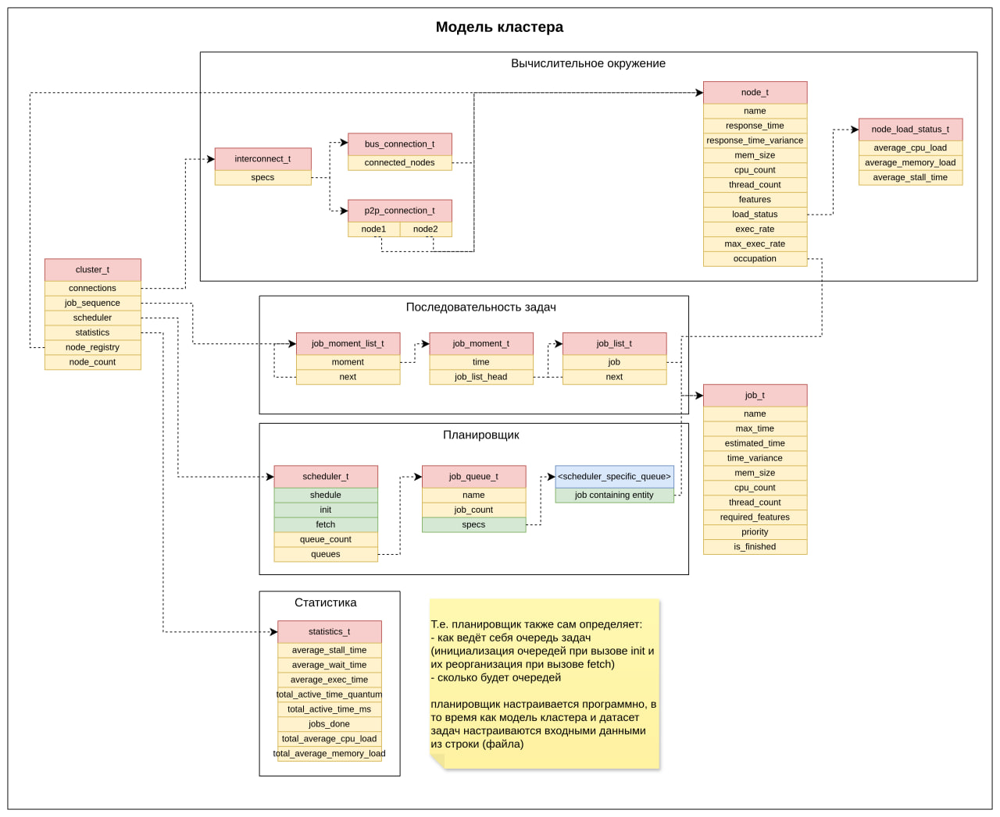

# ШПОРА ПО ДАТАСЕТАМ

## датасет с задачами
```
<момент времени (moment в job_moment_t)> \
<название задачи (name)> \
<примерное время выполнения (estimated_time)> \
<максимальное время выполнения (max_exec_time)> \
<максимальное время ожидания (max_wait_time)> \
<возможное отклонение по времени (time_varianve, игнорируется 
                                  при выключенном CONFIG_USE_TIME_VARIANCE)> \
<кол-во памяти (mem_size)> \
<кол-во небходимых процессоров (cpu_count)> \
<кол-во потоков  (thread_count, условно считается, что по 1 потоку на ядро)> \
<приоритет (priority, может игнорироваться планировщиком)>
<битовая маска с необходимыми вычислительными функциями (required_features)> \
```

## структура кластера
```
# для каждой кучи узлов сначала определяется топология

<тип шины (bus/p2p)> \
<мин. задержка при направке задачи> \
<макс. задержка при направке задачи> \
[кол-во узлов, если bus (connected_nodes_count в bus_connection_t)]

# потом для топологии уже определяются узлы в таком порядке:
<имя (name)> \
<время отклика (response_time)> \
<отклонение по времени отклика (response_time_variance)> \
<память (mem_size)> \
<кол-во процессоров (cpu_count)> \
<кол-во потоков/ядер на процессор (thread_count)> \
<максимальная скорость исполнения (max_exec_rate)> \
<возможности процессоров (features)>
```

все временные значения указываются в квантах
память указывается в условных единицах и может интерпретироваться как угодно (б, кб и так далее) с тем условием, что как для всех задач, так и для всех узлов будут подразумеваться одни и те же вещи
